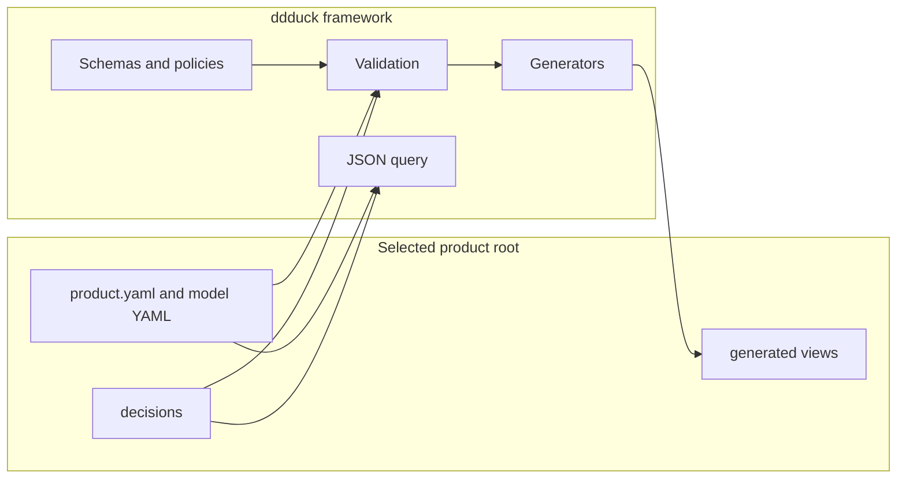
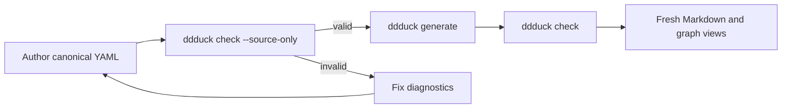
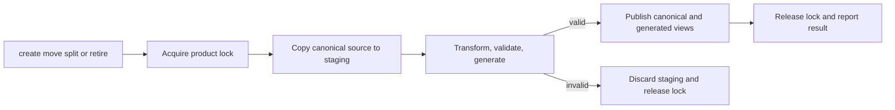
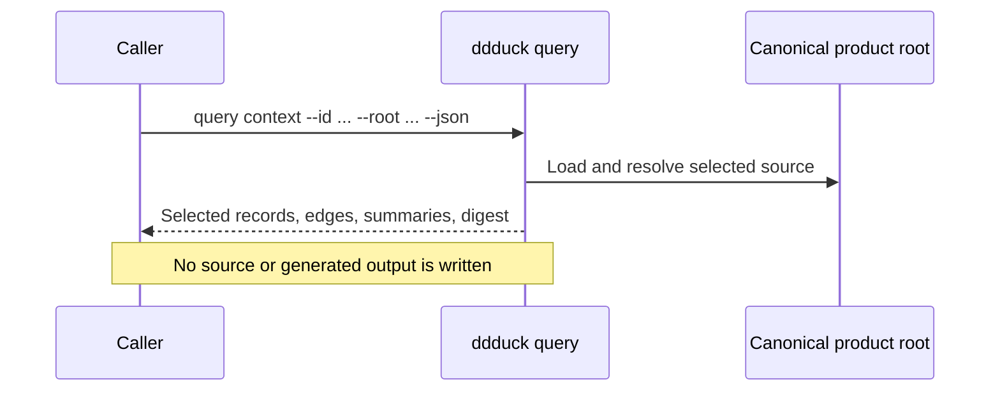

# Architecture

ddduck keeps product facts separate from framework contracts. Canonical product YAML is the
source of truth. Schemas, policies, validation, generation, and query code interpret that source;
they do not become product nodes. Generated views flow outward and are never canonical input.

## Authoring and verification

After manual canonical YAML edits, authors validate source with `ddduck check --source-only`, run
`ddduck generate`, then run default `ddduck check`. Default `check` verifies source and that
required generated views are fresh, so it cannot precede generation after a source edit.

## Staged lifecycle mutation

Guarantee mutations run against a contained staging copy. The CLI validates the complete staged
product and regenerated views before publication. A rejected operation publishes no intended
canonical or generated change; filesystem interruption beyond that tested boundary is a recovery
concern, not a database transaction guarantee.

## Query boundary

Queries are read-only and always emit exactly one JSON document (`--json` is accepted as a
no-op). A context query returns selected canonical records,
direct touching edges, one-hop summaries for unselected neighbors, and a source digest. The
source digest covers the canonical node YAML sources only — `product.yaml` and the files under
`model/` — so decision records under `decisions/` are outside its scope. It does
not recursively expand context or write canonical or generated files.

