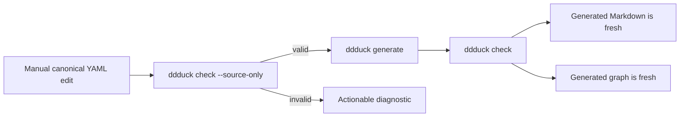

# Getting started

This executable journey creates a product with one Domain, one Concept, and one Guarantee.

## Install ddduck

Install the published CLI globally from npm:

```sh
npm install -g ddduck
ddduck --help
```

To contribute or run an unreleased revision, work from a local checkout instead. Either put the
`ddduck` bin on `PATH` with `npm link`:

```sh
git clone <ddduck-repository-url> ddduck
cd ddduck
npm install
npm link
ddduck --help
```

or skip linking and invoke the CLI directly from the checkout:

```sh
node <checkout>/scripts/ddduck.mjs --help
```

## Create the first product

Run the complete Bash block from an empty working directory with `ddduck` on `PATH`.



```bash
ddduck init ddd --id model:library

cat > ddd/model/domains/catalog.yaml <<'YAML'
schemaVersion: "1"
kind: Domain
id: domain:catalog
model: model:library
name: Catalog
purpose: Organize the library catalog.
concepts:
  - concept:book
interfaces: []
guarantees: []
YAML

cat > ddd/model/concepts/book.yaml <<'YAML'
schemaVersion: "1"
kind: Concept
id: concept:book
model: model:library
ownerDomain: domain:catalog
name: Book
purpose: Identify a catalogued book.
YAML

cat > ddd/product.yaml <<'YAML'
schemaVersion: "1"
kind: Model
id: model:library
name: library
purpose: Define the library product.
domains:
  - domain:catalog
useCases: []
decisions: []
YAML

ddduck check --root ddd --source-only
ddduck generate --root ddd
ddduck check --root ddd
ddduck create guarantee --origin catalog --classification invariant \
  --owner domain:catalog --statement "A Book has a stable catalog identity." --root ddd
ddduck query spec --root ddd --json
```

Default `check` requires both valid canonical source and fresh generated views. After a manual
source edit, use `check --source-only`, run `generate`, then use default `check`. Do not edit
`generated/` by hand.

The successful `create` allocates the first catalog invariant serial, adds it to the Domain, and
refreshes all generated views. The final query emits one JSON document suitable for a tool or
agent. See the [model reference](model-reference.md) before adding other node kinds, and use the
[CLI reference](cli.md) for the complete command contracts.
