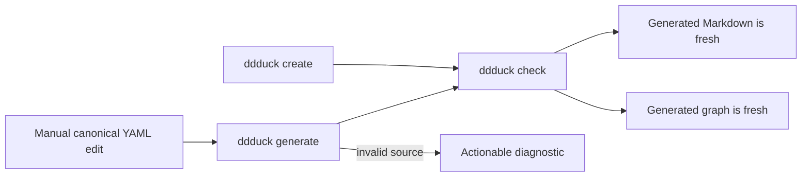

# Getting started

This executable journey creates a product with one Domain, one Concept, and one Guarantee.
For help deciding what belongs in that model, start with the
[definition workflow](definition-workflow.md).

## Install ddduck

Requires Node.js 22 or newer. Install the published CLI globally from npm:

```sh
npm install -g ddduck
ddduck --help
```

To contribute or run an unreleased revision, work from a local checkout instead. Either put the
`ddduck` bin on `PATH` with `npm link`:

```sh
git clone https://github.com/diegomarino/ddduck.git ddduck
cd ddduck
npm install
npm link
ddduck --help
```

or skip linking and invoke the CLI directly from the checkout:

```sh
node <checkout>/scripts/ddduck.mjs --help
```

## Create the first product

Run the complete Bash block from an empty working directory with `ddduck` on `PATH`, normally
inside a Git repository: `init` records the repository default in `.ddduck/config.json` at the
repository root, and without one writes it inside the new product root instead (see
[the CLI reference](cli.md#product-root-resolution)).



```bash
ddduck init ddd --id model:library

ddduck create domain --id domain:catalog --name Catalog \
  --purpose "Organize the library catalog." --root ddd
ddduck create concept --id concept:book --owner domain:catalog --name Book \
  --purpose "Identify a catalogued book." --root ddd
ddduck create guarantee --origin catalog --classification invariant \
  --owner domain:catalog --statement "A Book has a stable catalog identity." --root ddd
ddduck check --root ddd
ddduck query spec --root ddd --json
```

Default `check` requires both valid canonical source and fresh generated views. After a manual
source edit, `ddduck generate --root ddd` validates the source and refreshes the views;
use `ddduck check --root ddd` for final readback or CI. To diagnose source without writing
anything, run `ddduck check --root ddd --source-only`. Do not edit `generated/` by hand.

Each successful `create` updates the owning collection and refreshes all generated views.
Guarantee creation allocates the first catalog invariant serial. The final query emits one JSON document suitable for a tool or
agent. See the [model reference](model-reference.md) before adding other node kinds, and use the
[CLI reference](cli.md) for the complete command contracts.
