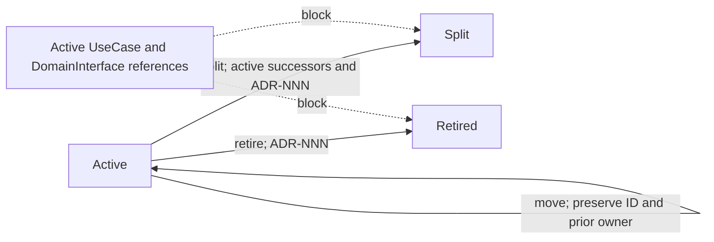

# Product model

ddduck models a product from canonical YAML. A product root contains one `product.yaml`,
its model nodes, decision records, and derived views. The root can live wherever the repository
chooses; `docs/ddd/` works well when the model is part of the repository's documentation, while
`ddd/` remains a compact default for a dedicated product root.

```text
docs/ddd/
  product.yaml
  model/
    domains/
    concepts/
    relationships/
    use-cases/
    interfaces/
    guarantees/
  decisions/
  generated/
    docs/model-overview.md
    graph/model-graph.json
    graph/model-graph.ndjson
    graph/model-graph.svg
```

`product.yaml` and `model/**/*.yaml` are canonical. `generated/` is derived output and
must be regenerated through `ddduck generate` rather than edited directly.
`.ddduck/config.json` may point commands at the selected root, but `.ddduck/` is tool metadata,
not product source.

## Nodes

Every canonical node declares a `schemaVersion`, `kind`, and `id`. The product root is the
one `Model` node; it does **not** declare `model`. Its `domains`, `useCases`,
`relationships`, and `decisions` list the owned top-level records. Every child node declares
`model` with that Model ID; domain-owned children also declare `ownerDomain`.

| Kind              | Purpose                                                               |
| ----------------- | --------------------------------------------------------------------- |
| `Domain`          | Owns concepts, interfaces, and guarantees.                            |
| `Concept`         | Names a domain-owned product idea.                                    |
| `Relationship`    | Records an explicit connection between canonical nodes.               |
| `UseCase`         | States a goal, its guarantee preconditions, outcomes, and interfaces. |
| `DomainInterface` | Declares a command or query boundary and its guarantees.              |
| `Guarantee`       | States an invariant or acceptance criterion with lifecycle state.     |

Guarantee IDs are stable. An active Guarantee can be moved, split into existing active
successors, or retired only when an ADR authorizes that lifecycle transition. Use cases and
interfaces cannot retain references to non-effective Guarantees.



## Decisions and evidence

Decision records live in `decisions/` and use the `ADR-NNN-*.md` filename convention.
Nodes may cite decisions. Interfaces may also declare evidence anchors with a product-relative
path, anchor name, and role (`source`, `decision`, or `verification`). The checker rejects an
anchor that escapes the selected product root or does not resolve to a regular file.

## Derived views and validation

`ddduck generate --root <product-root>` creates the model overview and graph views. `ddduck
check --root <product-root>` validates schemas, node ownership, references, decisions,
Guarantee lifecycle, evidence anchors, global policies, and documentation references. With
`--base <previous-product-root>`, it also verifies that historical Guarantee IDs were not
silently removed.

Use [the model reference](model-reference.md) for fields and minimal YAML, and
[the CLI reference](cli.md) for exact commands and JSON query contracts.
